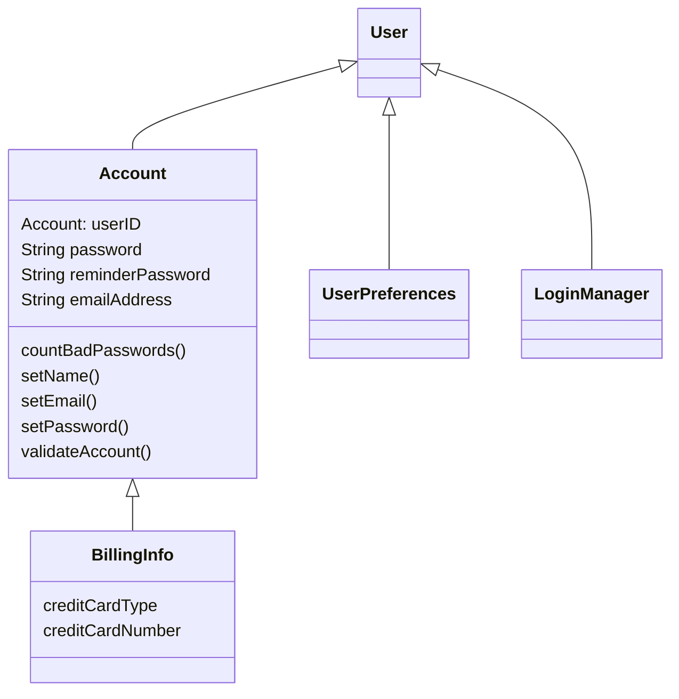
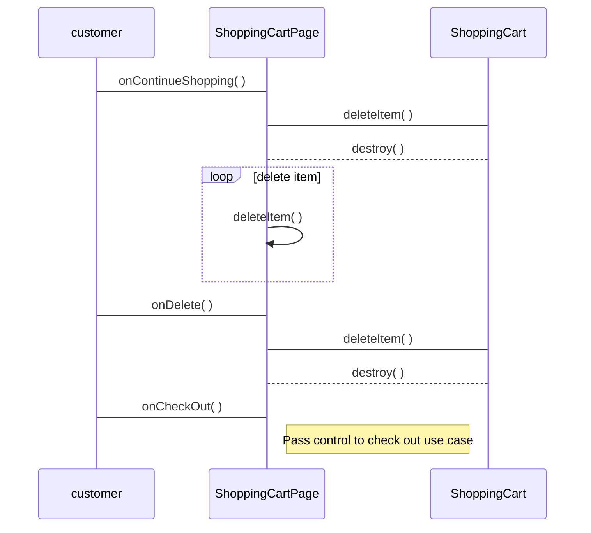

#  Что такое UML-диаграммы?

 **Unified Modeling Language** (UML) — унифицированный язык моделирования. Расшифруем: 
 + **_modeling_** подразумевает создание модели, описывающей объект;
 +  **_unified_** (универсальный, единый) — подходит для широкого класса проектируемых программных систем, различных областей приложений, типов организаций, уровней компетентности, размеров проектов. 

UML описывает объект в едином заданном синтаксисе, поэтому где бы вы не нарисовали диаграмму, ее правила будут понятны для всех, кто знаком с этим графическим языком — даже в другой стране.

# Для чего используется UML?

Одна из задач UML — служить средством коммуникации внутри команды и при общении с заказчиком. Рассмотрим возможные варианты использования диаграмм:

-   проектирование. UML-диаграммы помогут при  [моделировании архитектуры больших проектов](https://evergreens.com.ua/ru/development-services/software-architecture-design.html), в которой можно собрать как крупные, так и более мелкие детали и нарисовать каркас (схему) приложения. По нему впоследствии будет строиться код;
-   реверс-инжиниринг — создание UML-модели из существующего кода приложения, обратное построение. Может применяться, например, на проектах поддержки, где есть написанный код, но  [документация](https://evergreens.com.ua/ru/development-services/srs-development.html)  неполная или отсутствует.

## Нотация UML для описания логики проекта

Как и любой другой язык, UML имеет собственные правила оформления моделей и синтаксис. С помощью графической нотации UML можно визуализировать систему, объединить все компоненты в единую структуру, уточнять и улучшать модель в процессе работы. На общем уровне графическая нотация UML содержит 4 основных типа элементов:
-   фигуры;
-   линии;
-   значки;
-   надписи.

UML-нотация является де-факто отраслевым стандартом в области разработки программного обеспечения, ИТ-инфраструктуры и бизнес-систем.

## Часто используемые программы для создания диаграмм

-   [Diagrams.net](https://www.diagrams.net/) — удобный сервис для создания блок-схем, UML-диаграмм, моделей бизнес-процессов онлайн. Совместим с большинством популярных инструментов, включая Google Docs, Git, Dropbox, OneDrive и другие.
    

Источник: diagrams.net

-   [Dbdiagram.io](https://dbdiagram.io/home) — приложение для построения диаграмм связей для баз данных. Хороший инструмент для разработчиков и аналитиков.

-   [Google Drawings](https://docs.google.com/drawings) — бесплатный инструмент для создания блок-схем и диаграмм в составе Google Drive (менее удобный по сравнению с diagrams.net);
    
-   [xmind.net](https://www.xmind.net/)  — программа для построения интеллектуальных карт (mind map), логических схем, сложных структур, проведения брейнсторма и не только.

## Виды UML-диаграмм

В языке UML есть 12 типов диаграмм:
-   4 типа диаграмм представляют  **статическую структуру** приложения;
-   5 типов представляют  **поведенческие аспекты** системы;
-   3 представляют **физические аспекты** функционирования системы (диаграммы реализации).

Некоторые из видов диаграмм специфичны для определенной системы и приложения. Самыми доступными из них являются:
-   диаграмма прецедентов (Use-case Diagram);
-   диаграмма классов (Class Diagram);
-   диаграмма активностей (Activity Diagram);
-   диаграмма последовательности (Sequence Diagram);
-   диаграмма развёртывания (Deployment Diagram);
-   диаграмма сотрудничества (Collaboration Diagram);
-   диаграмма объектов (Object Diagram);
-   диаграмма состояний (Statechart Diagram).

## Диаграмма прецедентов — Use-Case Diagram

Диаграмма прецедентов использует 2 основных элемента:
1.  Actor (участник) — множество логически связанных ролей, исполняемых при взаимодействии с прецедентами или сущностями (система, подсистема или класс). Участником может быть человек, роль человека в системе или другая система, подсистема или класс, которые представляют нечто вне сущности.
2. Use Case (прецедент) — описание отдельного аспекта поведения системы с точки зрения пользователя. Прецедент не показывает, "как" достигается некоторый результат, а только "что" именно выполняется.

## Диаграмма классов — Class Diagram

Класс (class) — категория вещей, которые имеют общие атрибуты и операции. Сама диаграмма классов являет собой набор статических, декларативных элементов модели. Она дает нам наиболее полное и развернутое представление о связях в программном коде, функциональности и информации об отдельных классах. Приложения генерируются зачастую именно с диаграммы классов. 

## Диаграмма последовательности — Sequence Diagram
Используется для уточнения диаграмм прецедентов — описывает поведенческие аспекты системы. Диаграмма последовательности отражает взаимодействие объектов в динамике, во времени. При этом информация принимает вид сообщений, а взаимодействие объектов подразумевает обмен этими сообщениями в рамках сценария.

## Модель «Сущность-связь»

Модель «сущность-связь» (Entity-Relationship Model, ER-model) – одна из наиболее известных и получивших широкое распространение моделей семантического моделирования – разработана П. Ченом в 1976 году [1].

Основные элементы ER-модели:

-   сущность (entity) – это предмет, который может быть идентифицирован некоторым способом, отличающим его от других предметов;
-   атрибут – свойство сущности (как, правило, атомарное);
-   ключевый атрибут – уникальный атрибут, однозначно идентифицирующий экземпляр сущности;
-   связь (relationship) – это ассоциация, устанавливаемая между сущностями. Степень связи – количество связанных сущностей.

Выделяют следующие нотации ER-диаграмм:

-   классическая нотация П. Чена;
-   нотаци яIDEFIX (Integration Definition for Information Modeling);
-   нотация Ч. Бахмана;
-   нотация Дж. Мартина («вороньи лапки»);
-   нотация Ж.-Р. Абриаля (минмакс);
-   диаграммы классов UML.

При построении ER-модели важно выделять типы бинарных связей, выделяют 4 типа связи (см. рисунок):
-   ноль или более;
-   один или более;
-   только один;
-   ноль или один.

### Заключение

Как видим, на первый взгляд банальный набор фигур и стрелок может значительно упростить решение сложных задач в программировании, помочь при выборе оптимального решения и разработке технической документации. Какие еще выводы можем сделать:
-   строить диаграммы несложно;
-   диаграммы очень легко читаемы и просты для понимания;
-   они — отличный инструмент для проектирования архитектуры и поведения;
-   необходимы для документирования любой нетривиальной системы. 

Позволяют легко понять связи между модулями и интеграциями в системе.
